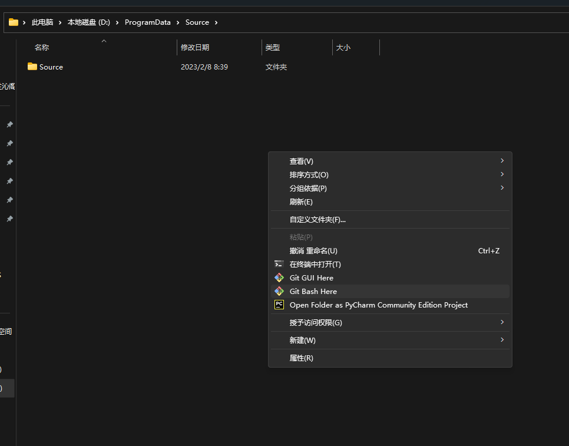
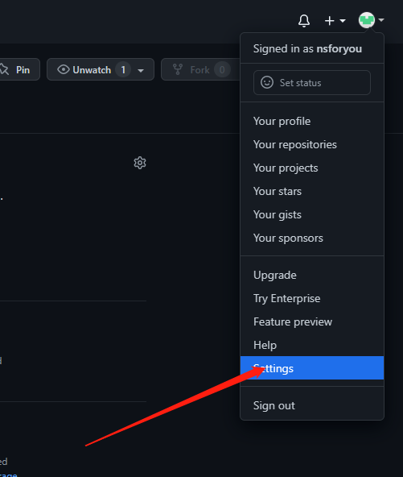
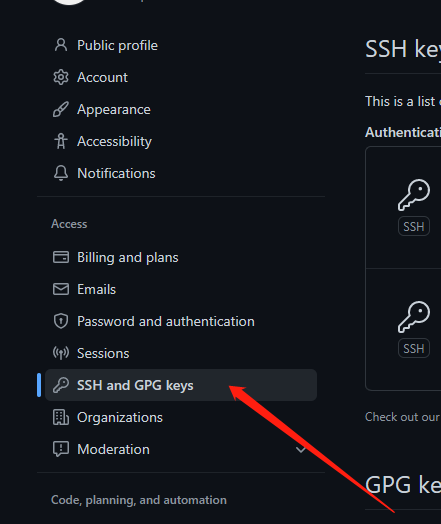
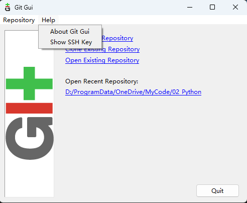
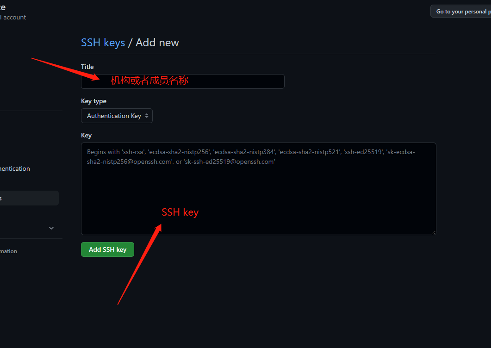

## 1 create a new repository on the command line

在命令行中创建新的仓库

```text
echo "# Source" >> README.md
// 新建一个叫README.MD的文件夹
git init
// 创建一个新的git仓库
git add README.md
// 添加文件README.md到待保存区
git commit -m "first commit"
// 添加提交代码的注释
git branch -M main
// 这是干嘛的？
git remote add origin https://github.com/nsforyou/Source.git
//关联远程仓库，在做这一步之前需要添加当前电脑的SSHkey到 github帐号下
git push -u origin main
//推送本地修改好的文件到远程仓库 main分支下。
```

## 2 pull an existing repository from the command line

在命令行中拉取一个已经存在的远程仓库

1.选择即将同步仓库的位置 点击鼠标右键git bash here



2.打开github→Settings→SSH and GPG keys



3.在GIT GUI中复制SSH



4.在github中添加SSHkey



5.返回git bash敲代码

```plaintext
git init
//在此处创建代码仓库

git remote add origin https://github.com/nsforyou/Source.git
//关联远程仓库

//貌似这一步之前还有一个有关服务认证的问题，在CSDN能找到答案 下次遇到了要记录

git clone
//克隆远程仓库
```
